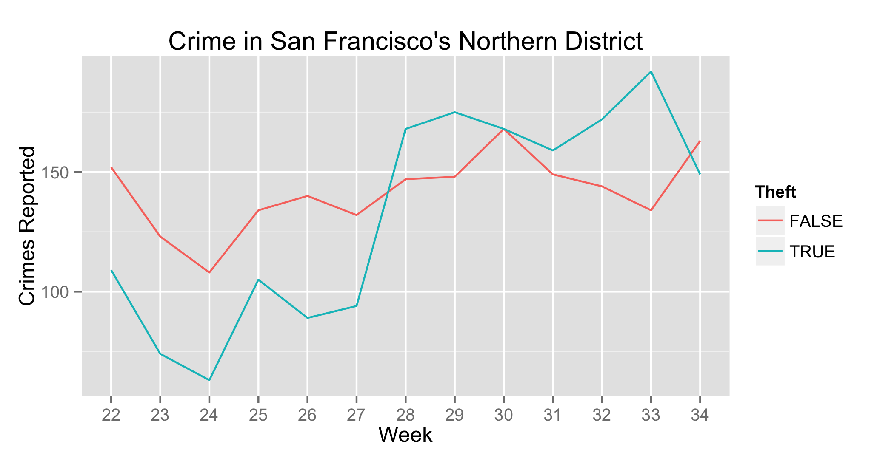
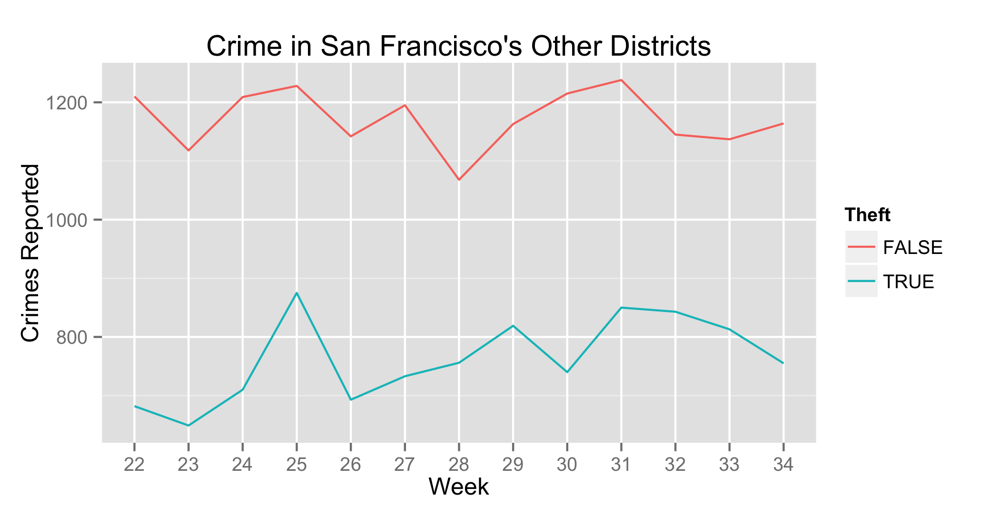
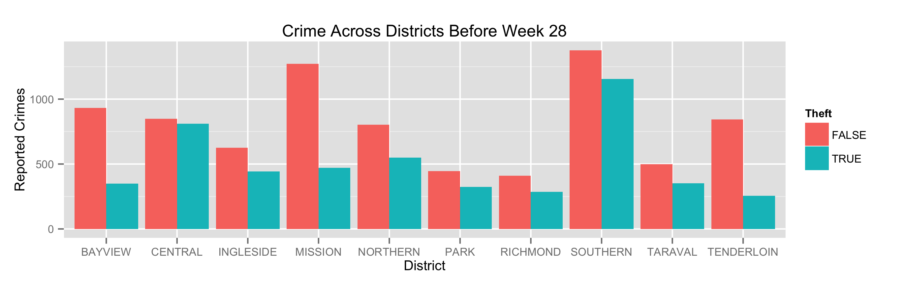
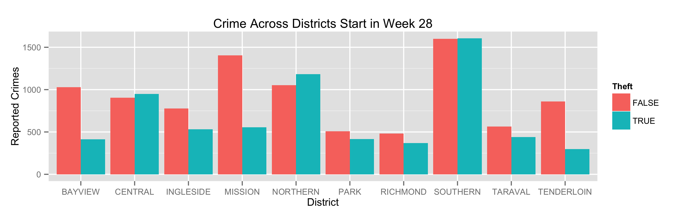

Increased Theft in San Francisco's Northern District
========================================================

The summer of 2014 saw a rise in theft in San Francisco's Northern police district.

In the early weeks of summer (22-27), thefts averaged about 78 per week, but in the second half of summer (weeks 28-34), thefts more than doubled to an average of 169 per week.

While non-theft crimes also grew slightly over the summer, their trend did not match that of thefts.

Theft, as well as other types of crime, had slow growth in the remainder of the city, following the pattern of the Northern district's non-theft growth rate.

To further demonstrate that this change is not a city wide phenomenon, these two charts show the breakdown of reported crime across all districts for theft and non-theft types of crime.

Here you can see that the Northern district's theft rate went from a weak third, to a strong second place, with only the Southern district having a worse rate of theft.
